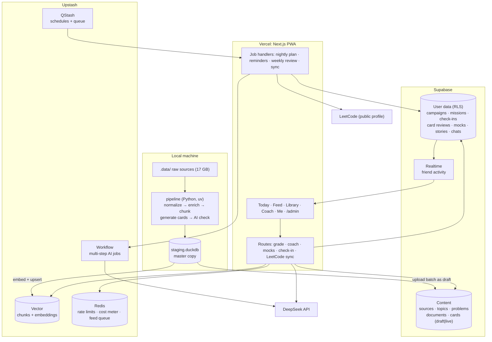

# 90X Spec

The single source of truth for what 90X is and how it's built.

Status: draft for review · 2026-09-26
Older versions live in `archive/` for history only. The ChatGPT research in `chatgpt-research/` is reference only and partly outdated; this file wins wherever they disagree.

## 1. Goal

90X helps a small invite-only group (me and friends) become interview-ready for software engineering roles within a campaign of a chosen length (30, 60 or 90 days, changeable).

Success looks like:
- We open it every day and finish the day's missions most days.
- Readiness goes up in a way we trust, because it's computed from what we actually did.
- Our weakest areas get the most practice without us having to plan it.
- We can see each other's progress, which keeps both of us going.

## 2. MVP scope

The MVP is the tracker and the feed, both complete, plus the library and the coach.

| # | Part | Delivers |
|---|---|---|
| 1 | Data pipeline | Normalized catalog, topic tree, documents, chunks in Upstash Vector, generated and checked cards uploaded as drafts |
| 2 | Foundation + Library | Google login with allowlist, setup and diagnostic, Library (Pattern Map, problems, notes), check-ins, LeetCode sync, friend visibility |
| 3 | Tracker | Daily template, missions, 90 Grid, review queue, readiness, Me dashboard |
| 4 | Feed | Card feed, topic toggles, typed answers, grading, FSRS reviews, flags, `/admin` batch review |
| 5 | Coach | Mission reasons, explain, chat with sources, mock interviews (text), STAR story bank, weekly review, memory service evaluation |

Build order: 1 and 2 in parallel, then 3, 4, 5. Grading (needed by 4) is built inside part 4. Each part gets its own implementation plan.

Out of scope for the MVP: voice mocks, in-app code editor (LeetCode is used), design canvas (Excalidraw is used), native apps, browser extension, public signup, XP and badges.

## 3. Decisions

| Area | Decision |
|---|---|
| Users | Invite-only: Google login + email allowlist. Everyone in the group sees everyone's progress |
| Privacy | Friends see scores, streaks, check-ins (without notes), mock scores. Private: check-in notes, coach chats, coach notes, stories |
| Campaign length | 30/60/90 or custom; can change anytime. Grid redraws, remaining days replan |
| Missed day | Square marked missed, streak resets, end date fixed. Unfinished review slots carry over; new-item slots are re-picked. Slot counts never grow to catch up |
| Day boundary | Midnight in each user's timezone |
| Daily plan | Daily template per weekday: fixed counts per slot type (see 6.2). Coach may suggest template changes; the user accepts or declines |
| Company focus | Optional, time-boxed mode (company + date range). Boosts that company's problems while active |
| LeetCode | Manual check-in + Sync button + QStash sync every 6 h. Sync creates check-ins, ticks missions, then asks for time with one-tap chips |
| Extra work | Any check-in counts toward readiness and ticks a matching mission |
| Behavioral | STAR story bank (6–8 stories) + short behavioral mocks that use them |
| DSA language | Chosen in setup (Java, Python, C++, JS). Solutions and code cards use it where the source has it |
| Onboarding | Setup, then a ~15-minute diagnostic of ~20 mixed cards so readiness and the first plan start from data |
| Feed topics | DSA patterns, system design, CS core (OS, DBMS, CN, OOP), Java, SQL. Each can be toggled |
| Feed limit | Unlimited. After 20 cards with missions unfinished, a banner points back to Today |
| Review timing | FSRS spaced repetition per card |
| Pass mark | 70% of key points or more counts as correct |
| Skip | Means "I don't know": shows the answer, scores 0, schedules review |
| Card quality | Only important sources; strict generation rules; AI check; sample review of ~30 cards per batch in `/admin` (batch passes at 90%); in-app flags |
| Library | Everything published is browsable and readable in-app, with source links. ~300 curated competitive problems in their own tab, Library only |
| Coach name | Coach |
| Mock format | Text chat with timer and stage prompts; voice later |
| Coach memory | Own tables (progress, `coach_notes`) for the MVP. Zep and Letta evaluated when part 5 is designed |
| Coach search | Upstash Vector (semantic, built-in embeddings) |
| Readiness | Formula score on the dial; the coach's weekly read shown beside it, never changing the number |
| AI provider | DeepSeek via Vercel AI SDK (web) and `openai` SDK (pipeline); switchable by env. Flash for grading, Pro for coach and mocks |
| AI budget | $10/month for the group. Warn at 80%; at 100% coach and mocks fall back to Flash, grading continues |
| Notifications | Web push: evening streak reminder (8 pm), friend activity, weekly review ready, morning plan (time chosen by user) |
| Offline | Read-only: today's missions and ~30 queued cards cached; answers sync and grade when back online |
| Monitoring | Sentry, Vercel Analytics, `ai_usage` table |
| Laya | Pipeline experiment only: competitive triage, adopted if it holds up on ~200 hand-labeled problems |

## 4. Architecture



- Content only changes through the pipeline's upload and the `/admin` publish step. The app never writes content, except flag counts.
- AI calls only run on the server.
- `staging.duckdb` is the master copy of content and chunks, so the vector index and content tables can be rebuilt from it.

## 5. Data model

### 5.1 Content (Supabase, read-only for users)

| Table | Key columns |
|---|---|
| `sources` | name, url, license, domain |
| `topics` | parent_id, domain (dsa, system_design, cs, java, sql, lld, ai, behavioral), name, slug, importance |
| `topic_links` | from_topic, to_topic (Pattern Map edges) |
| `problems` | kind (leetcode, competitive), lc_number, slug, title, difficulty, pattern_topic_id, topic_ids, importance, nc150, blind75, companies (company → frequency), statement_md, solutions (language → code), video_id, source_id |
| `documents` | topic_id, title, body_md, url, source_id |
| `card_batches` | domain, topic_ids, created_at, ai_pass_rate, sample_pass_rate, status (draft, published, rejected) |
| `cards` | batch_id, topic_id, problem_id, document_id, format (typed, flash, mcq, output, bug), difficulty, prompt_md, options, answer_md, key_points, source_refs, quality, status (draft, live, retired), flag_count |

### 5.2 User data (Supabase, RLS)

| Table | Key columns |
|---|---|
| `allowlist` | email, is_admin |
| `profiles` | user_id, name, role, language, timezone, leetcode_username, notification settings |
| `campaigns` | user_id, start_date, length_days, status, templates (weekday → slots), company_focus (company, from, to) |
| `days` | campaign_id, date, status (pending, done, partial, missed) |
| `missions` | user_id, date, slot_type, ref (problem, card set, topic, mock, story), est_minutes, status, reason |
| `checkins` | user_id, problem_id, result (solved, hints, failed), minutes, note, source (manual, leetcode_sync), created_at |
| `card_reviews` | user_id, card_id, answer, score, points_hit, outcome, graded_by (match, ai, self), created_at |
| `card_state` | user_id, card_id, FSRS fields (stability, difficulty, due_at, reps, lapses) |
| `mocks` | user_id, type (design, behavioral), prompt, transcript, rubric_scores, score, feedback |
| `stories` | user_id, title, situation, task, action, result, tags |
| `coach_threads`, `coach_messages` | user_id, thread, role, content, citations |
| `coach_notes` | user_id, text, source (user, coach) |
| `readiness_snapshots` | user_id, date, overall, per_area |
| `weekly_reviews` | user_id, week_start, formula_score, coach_score, summary_md, suggested_changes, accepted |
| `card_flags` | user_id, card_id, reason |
| `push_subscriptions` | user_id, endpoint, keys |
| `ai_usage` | user_id, route, model, tokens_in, tokens_out, cost_usd, created_at |

Friends read `checkins` through a view without the `note` column. `coach_*` tables and `stories` are owner-only.

### 5.3 Upstash

- **Vector:** one index of chunks (300–500 words). Each vector stores the chunk text plus metadata: document_id or problem_id, topic, source, title, url. Sizes chosen to fit the plan's per-vector limits.
- **Redis:** rate limits per user and route; monthly AI cost meter; per-user queue of the next ~30 feed cards.
- **QStash schedules:** nightly planning, morning plan push, 8 pm reminder, Sunday weekly review, LeetCode sync every 6 h.
- **Workflow:** weekly review, template suggestion, mock final scoring.

## 6. Logic

### 6.1 Readiness

- Area score = coverage × recent accuracy × 100.
  - Coverage: importance-weighted share of the area's important items practiced.
  - Recent accuracy: check-ins (solved 1, hints 0.5, failed 0), card scores and mock rubric scores; the last 14 days count double.
- Overall = weighted mean of areas by role. Backend default: DSA 35, Design 25, CS 20, Java 15, SQL 5.
- Bands: under 40 red, 40–69 yellow, 70 and up green.
- The coach's weekly read (its own estimate and reasons) is stored in `weekly_reviews` and shown beside the dial.

### 6.2 Daily template and missions

- Each weekday has a template of slots. 90X proposes one from the time budget; the user edits it. Example weekday (2h 30m): 2 DSA problems (1 new, 1 review), 1 design topic (30m), 20 feed cards (CS, Java, SQL).
- Slot types: new problem, review, design topic, mock (design or behavioral), cards (count + topics), story.
- The nightly job fills each slot:
  - Review slots: due items first, most overdue first.
  - New problem slots: the weakest pattern in the area, then the most important unsolved problem in it; company focus boosts that company's problems.
  - Design topic, mock and story slots: the weakest untouched topic or story gap.
- Each mission stores a one-line reason, shown by the coach line on Today.
- Finishing every mission marks the day done and crosses its square. Some finished = partial. None = missed.
- The coach can propose template changes in the weekly review; nothing changes without Accept.

### 6.3 Feed

- Priority = importance × weakness(topic) × due-review boost, for topics switched on.
- The Redis queue holds ~30 cards, mixed about 50% weak areas, 30% due reviews, 20% new, never two cards in a row on the same topic.
- A card flagged twice, or skipped by everyone for 14 days, is hidden until reviewed in `/admin`.

### 6.4 Grading

1. Normalized exact match against the answer and key points: 100%, no AI call.
2. Otherwise DeepSeek Flash returns which key points the answer covers; score = hit ÷ total.
3. 70% or more is correct. Skip scores 0 and shows the answer.
4. The score updates FSRS state and readiness.
5. If the model's output fails schema validation, retry once, then ask the user to self-mark.
6. Multiple choice and output cards compare to the stored answer; no AI.

### 6.5 Card generation and review

1. Only important material: NeetCode 150 and Blind 75 first, then company-frequent problems, then high-submission problems; for other areas, an approved topic list (~150–200 topics drafted by AI from the sources, approved once).
2. Each card is grounded in a source passage, tests one concept, has 2–4 key points, and must pass "would an interviewer ask this?".
3. A second AI pass scores correctness against the source, clarity and interview relevance; low scores and near-duplicates are dropped.
4. The batch is uploaded as draft. In `/admin` I review ~30 random cards; 90% good publishes the batch, otherwise it is regenerated.
5. Generation runs off-peak for DeepSeek's half price.

### 6.6 Check-ins and LeetCode sync

- Manual check-in: result, time chip, optional note. Ticks the matching mission and updates readiness.
- Sync (button or every 6 h): pulls recent accepted solves (~20, unofficial endpoint), creates missing check-ins as solved, ticks missions, then offers time chips. Hints and failures stay manual.

### 6.7 Cost guard

- Every AI call logs to `ai_usage` and adds to the Redis cost meter.
- At 80% of $10/month: warning. At 100%: coach and mocks switch to Flash; grading continues.

## 7. Visual system

Approved mockups are in `.planning/mockups/` (open any file in a browser): mobile and desktop screens, colour system, signatures. Mockup fragments rely on the brainstorm frame for page chrome, so they render unstyled around the edges when opened directly.

### 7.1 Tokens

| Role | Value |
|---|---|
| Background | `#0A0C10` |
| Surface / surface 2 | `#0F1218` / `#141820` |
| Line / line 2 | `#1C2029` / `#262B36` |
| Text / secondary / muted | `#E6E9EF` / `#AEB5C2` / `#7D8594` |
| Accent (cyan) / accent background | `#67E8F9` / `#0E1E24` |
| Topics | DSA `#818CF8` · Design `#C084FC` · CS `#2DD4BF` · Java `#FB923C` · SQL `#F472B6` |
| Status | Ready `#4ADE80` · Getting there `#FACC15` · Not yet `#F87171` |

Rules: accent marks actions and "you are here"; topic colour says what something is about; status colour says how well you're doing. Roles never swap. Everything else is neutral. Dark theme only.

### 7.2 Type

Sora for titles and numbers, Manrope for everything else. Six sizes only:

| Style | Spec |
|---|---|
| Display | Sora 700, 32px (dial 44–48px) |
| Title | Sora 600, 22px |
| Heading | Sora 600, 16px |
| Body | Manrope 500, 15px |
| Small | Manrope 500, 13px, muted |
| Tag | Manrope 700, 12px |

### 7.3 Layout

- Spacing: 24px between sections, 16–20px inside cards, list rows about 14px vertical padding.
- Borders on cards, no shadows. Shadows only on floating layers (bottom sheets, popovers).
- Mobile: bottom tab bar (Today, Feed, Library, Coach, Me) with icons and labels, active tab on an accent pill. Page header = title plus at most one icon action.
- Desktop: 220px left sidebar, content in two or three columns. Library shows the check-in panel inline; Feed shows "why this card" and session progress beside the card; Me adds the 14-day trend, weakest patterns and friend activity.

### 7.4 Signatures

- **90 Grid** (Today): one square per day, crossed with an X when done; the X stamps in with a short animation.
- **Scoreboard** (Me): readiness dial coloured by band, area bars in topic colours with status-coloured numbers.
- **Pattern Map** (Library): patterns as linked nodes lit by mastery; the weakest pulses.
- Motion respects `prefers-reduced-motion`.

## 8. Error handling

- AI output validated with Zod; one retry, then a graceful fallback (self-mark, or "coach unavailable, try again").
- LeetCode sync failures are logged and shown as "Sync unavailable"; manual check-in always works.
- Offline answers queue locally and grade on reconnect.
- QStash retries failed jobs; repeated failures reach Sentry.
- Budget exhaustion degrades models and never blocks grading or check-ins.

## 9. Testing

- Unit tests (Vitest) for readiness, slot filling, feed ordering, FSRS updates, grading normalization, cost meter.
- Integration tests for RLS policies (friend can read, can't write; private tables hidden).
- Pipeline tests on small fixtures for normalization, enrichment joins and card validation.
- Playwright smoke tests: sign in, check in, answer a card, finish a day.
- A small fixed set of graded answers to check the grading prompt stays consistent when prompts or models change.

## 10. Stack

| Layer | Choice |
|---|---|
| Web app | Next.js (App Router) + React 19 + TypeScript, React Compiler |
| UI | Tailwind CSS + shadcn/ui |
| Mobile | Installable PWA: `manifest.ts` + `public/sw.js`, web-push for nudges |
| Database | Supabase Postgres, Row Level Security on all user tables |
| Migrations | Supabase CLI SQL files in `supabase/migrations/` (source of truth, includes RLS) + `seed.sql` |
| DB access | Drizzle ORM for typed server-side queries (schema pulled with `drizzle-kit pull`); supabase-js for auth, realtime and client reads under RLS |
| Auth | Supabase Auth with Google login |
| Realtime | Supabase Realtime for the friend view and challenges |
| Client data | TanStack Query |
| Validation / dates | Zod, Luxon |
| AI in app | Vercel AI SDK (`ai`) in Next.js API routes, provider set in `web/src/lib/ai.ts` from env: DeepSeek, Anthropic or any OpenAI-compatible endpoint. `AI_MODEL_FAST` (deepseek-flash) for grading and quizzes, `AI_MODEL_SMART` (deepseek-v4-pro) for the mock interviewer |
| Data pipeline | Python in `pipeline/`: download, normalize, enrich, card generation. `openai` SDK against any OpenAI-compatible endpoint (DeepSeek by default), run off-peak for half price |
| Testing / lint | Vitest, Playwright, ESLint, knip |
| Package managers | Bun for the app (package manager + scripts; Next.js runs on Node), uv for Python |
| Env files | One environment. `web/.env.local` (Next.js loads it; same values go into Vercel) and `pipeline/.env`. Templates in each `.env.example` |
| Jobs, cache, search | Upstash: QStash (schedules, queue), Workflow (multi-step AI jobs), Redis (rate limits, cost meter, feed queue), Vector (coach search, built-in embeddings) |
| Monitoring | Sentry, Vercel Analytics, `ai_usage` table |
| Hosting | Vercel (app), Supabase cloud (DB), Upstash; pipeline runs locally |

Reference projects:
- `../Owe`: Supabase setup (CLI migrations, RLS, Google OAuth, TanStack Query)
- `../curfew`: Next.js app structure, PWA manifest + service worker, web-push

### 10.1 Repo layout
```
90X/
├── .planning/     spec and research
├── .data/         raw downloads (git-ignored)
├── pipeline/      Python data pipeline (uv)
├── supabase/      migrations, seed.sql, config
└── web/           Next.js app (bun)
```

## 11. Data sources

All 42 sources were verified on 2026-09-26 (they exist, fields checked, sizes known). The full list with roles lives in `pipeline/src/pipeline/sources.py`; run `uv run pipeline sources` to print it. Total is ~19 GB, most of it the three competitive sets. Those are big because they ship full hidden test suites (99% of their bytes), not because they have more problems.

Roles:
- **cards:** cards generated in the MVP (feed topics: DSA patterns, system design, CS core, Java, SQL)
- **enrich:** adds importance, pattern, video or solutions to other sources
- **reference:** downloaded, no cards yet

Competitive programming is its own domain (`competitive`), separate from interview DSA: contest-style problems with stdin/stdout and huge test suites. Downloaded, low weight, no cards yet.

Key sources:

| Domain | Source | Role | Why |
|---|---|---|---|
| DSA | `newfacade/LeetCodeDataset` (HF) | cards | ~2.6K problems with tags, difficulty, solution, tests, explanation |
| DSA | `neetcode-gh/leetcode` → `.problemSiteData.json` | enrich | 450 problems: NeetCode pattern, NC150/Blind75 flags, YouTube video id |
| DSA | `kaysss/leetcode-problem-detailed` (HF) | enrich | Topic tags, acceptance rate, submission counts |
| DSA | `greengerong/leetcode` (HF) | enrich | Java/C++/Python/JS solutions |
| DSA | liquidslr, snehasishroy, LeetMap-Pro | enrich | Company-wise frequency |
| DSA | Chanda-Abdul coding patterns | enrich | Pattern explainers |
| Competitive | PrimeIntellect, open-r1, livecodebench | reference | ~18 GB, mostly hidden test cases |
| System design | System Design Primer, karanpratapsingh/system-design | cards | Structured guides + solved scenarios |
| System design | ByteByteGo 101, Grokking SD, awesome-scalability, others | reference | |
| LLD | Grokking OOD, awesome-low-level-design | reference | Case studies with code |
| OS | OSTEP (68 chapter PDFs) | cards | |
| CS | LastMinuteNotes, CS-Fundamentals-Interview, devops-exercises, Little Book of Semaphores | cards | CN, DBMS, OOP, OS, concurrency |
| Java | java-basics, in28minutes interview-guide, Devinterview Java | cards | Language internals, collections, concurrency |
| SQL | sql-basics | cards | Queries, joins, indexing |
| AI | AIMLInterviews, ml-interviews-book, LLM questions, data science Q&A | reference | |
| Behavioral | tech-interview-handbook, big-companies questions, others | reference | Behavioral questions for the mock interviewer |

### 11.1 DSA enrichment

- **Pattern:** NeetCode's pattern label where the problem is in its 450; for the rest, the AI tags the pattern from the solution code. Hand-check ~50 before trusting.
- **Importance:** NeetCode 150 / Blind 75 first, then company frequency, then acceptance and submission counts.
- **Videos:** NeetCode's YouTube id where available.
- **Pattern explainers:** one per pattern (~18), starting from the coding-patterns repo.
- **Links:** cards link to their source directly. The AI never writes URLs.
