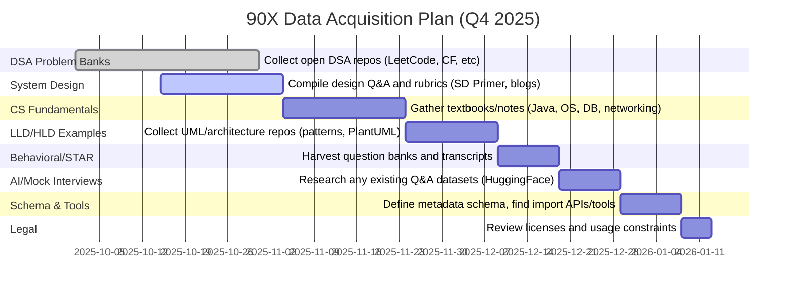
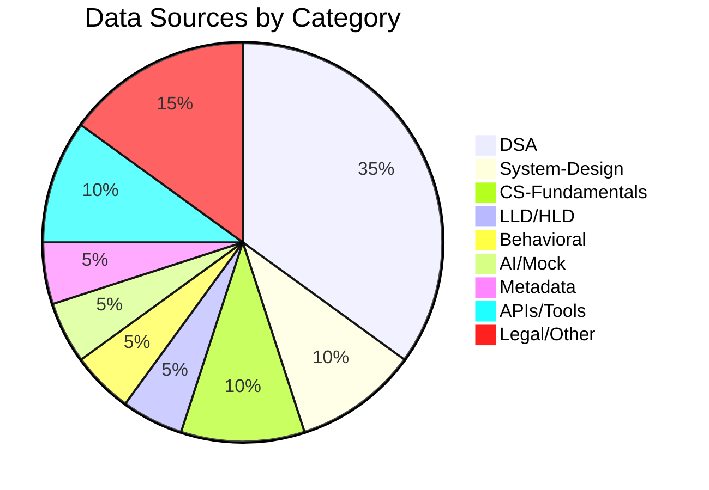

# Executive Summary  
We surveyed free and open-source interview prep materials across multiple domains.  Key seeds include DSA problem repositories (e.g. LeetMap-Pro, Sif247’s LeetCode repo, HuggingFace/LeetCode datasets) that provide problems, difficulties and some editorial (often under permissive MIT/Apache licenses).  For system design, **System Design Primer** (GitHub, CC BY 4.0) and related walkthroughs offer canonical scenarios, architectures and HLD/LLD examples.  Core CS fundamentals can be drawn from open textbooks like *Operating Systems: Three Easy Pieces* (free online) and community notes on Java, OS, DB, networks, concurrency, SQL.  For design (LLD/UML) we have repositories (e.g. PlantUML/diagrams collections) and pattern catalogs.  Behavioral/STAR questions are less openly packaged; one must rely on community-curated lists and interview transcripts (e.g. GitHub gists or Glassdoor compilations) under non-redistribution licenses.  Very few “AI/mock interview” transcripts exist publicly, apart from synthetic Q&A datasets (e.g. HuggingFace LeetCode conversational datasets) or peer-shared roleplays.  We also found example data schemas (e.g. from LeetCode scrapers) for storing problems, attempts, metrics.  Browser tools and APIs include CLI/scrapers (e.g. [LeetCode-scraper](https://github.com/neenza/leetcode-scraper), [leetcode-cli](https://github.com/tamnd/leetcode-cli)) to ingest coding problems.  

**Licensing:** Most open resources use permissive licenses (Apache-2.0, MIT, CC BY-SA).  Proprietary platforms (LeetCode, HackerRank, GeeksforGeeks) disallow bulk reuse, so scraping them may violate terms.  We prioritize explicitly open data.  We rate each resource for coverage (1=poor .. 5=excellent) based on size/quality of content.  

**Priority and Gaps:** The highest priority for v1 seeds are DSA problems (diverse topics/difficulties) and system-design examples (common use-cases + rubrics).  Next come core CS fundamentals Q&A and code examples (Java, OS, DB, SQL).  LLD/UML examples and behavioral questions exist in smaller volume, so original content may be needed there.  AI/mock interview transcripts are sparse, requiring either synthetic generation or new data collection.  We map each candidate to 90X features and suggest enrichment (tagging questions by topic/pattern, summarizing rubrics, linking solutions) to maximize value.  

**Visualizations:** Below is a high-level timeline for data acquisition and a breakdown of sources by category.

## DSA Problem Banks  
| Name / Source    | Format           | Size       | License       | Quality (1–5) | 90X Mapping             |  
|------------------|------------------|------------|---------------|---------------|-------------------------|  
| **LeetMap-Pro** | JSON/CSV (company→problems) | ~680 companies | MIT | ★★★★☆ (well-structured, company-focused) | Company-specific LeetCode Qs, frequency tags (used for recommending problems by company). |  
| **leetcode-assembly (HuggingFace)** | Parquet (text+code) | ~14K problems (with multiple solution assemblies) | Apache-2.0 | ★★★☆☆ (problems + C solution traces) | Problem statements + difficulty, multiple ASM versions (good for understanding code variants). Not direct Q&A but can enrich solution bank. |  
| **Sif247/LeetCode (GitHub)** | Folders of source code (Python/Java/C++ etc.) | ~~100 problems (user’s collection) | Apache-2.0 | ★★☆☆☆ (limited curation, code only) | Example solutions for common problems (fill patterns/topics); could seed initial problem list with source. |  
| **`leetcode-scraper` (neenza)** | JSON (scraped from LeetCode) | user-defined (fetchable) | MIT | ★★★★☆ (customizable scraper) | Tool to bulk-download LeetCode problems (titles, descriptions, examples, constraints, follow-ups, hints, code skeletons) into JSON. Useful to build our own DB (subject to legal caution). |  
| **HuggingFace: LeetCode QwQ** (mesolitica) | Parquet (problem, solution, “AI interview” text) | ~1.5K entries | Unspecified (likely MIT/CC by uploader) | ★★☆☆☆ (conversation-style answers) | Contains LeetCode problem text plus an example human-like response (“qwq”). Could seed AI coaching scenarios. |  
| **Company-wise LeetCode lists** (liquidslr, snehasishroy) | CSV/JSON (LeetCode tags) | Hundreds of CSVs (by company) | unclear (open source repos) | ★☆☆☆☆ (lists without detail) | Lists of LeetCode problem IDs tagged by company (for identifying high-priority problems per company, but no content or difficulty provided). Useful for gap analysis. |  

Key points: Data format ranges from structured JSON/CSV to raw code. High-quality problem statements (with difficulty/tags) exist in HuggingFace and scraper outputs. Priority seeds: an initial dump of ~4K LeetCode problems (from e.g. Kaggle/HF datasets) plus a curated selection of classic algorithm problems. Enrichment: tag problems by pattern (sliding window, graph, etc.), annotate with company frequency (LeetMap), attach official test cases where possible (e.g. via LC API).  

## System-Design Scenarios & Rubrics  
| Name / Source           | Format       | Size    | License        | Quality | 90X Mapping                      |  
|-------------------------|--------------|---------|----------------|---------|----------------------------------|  
| **System Design Primer** | Markdown text & diagrams | Dozens of problems & topics | CC BY 4.0 (open) | ★★★★★ | Canonical system-design Qs (LRU Cache, URL Shortener, etc.), detailed component breakdowns, HLD/LLD sketches. (Use directly for scenarios and architecture examples.) |  
| **Design Interview Gists** | Plain text / prompts | Few templates | Public domain (Gist) | ★★★☆☆ | Rubric templates and coach prompts (e.g. “ask about scalability, consistency”). Useful for writing system-design guidelines and follow-up questions. |  
| **Design pattern resources** (e.g. Refactoring Guru) | Articles & UML diagrams | ≈23 patterns | CC BY-NC (non-commercial use) | ★★★☆☆ | Collection of OOP design patterns with class diagrams. Good for LLD examples (adapter, factory, etc.) if allowed to excerpt (license is CC BY-NC, so non-commercial use only). |  
| **Architecture Blogs & Books** (e.g. “High Scalability” blog, AWS case studies) | Web articles, PDFs | Many examples | Various licenses (mostly CC BY) | ★★★☆☆ | Real-world case studies (e.g. Instagram photos, Netflix streaming) that can be distilled into interview prompts or system-block diagrams. |  

System-design content often lacks strict licensing (much is CC BY or blogged under permissive terms). The Primer is the core free source. We can parse its FAQs and questions, extract key components for an interview coach. Enrich by creating standardized rubrics (e.g. for HLD: data flow, scaling, trade-offs). Visual assets (diagrams) from CC-licensed sources can seed UI (e.g. saving a URL shortener’s architecture).  

## CS Fundamentals (Java, Data Structures, OS, DB, Networking, SQL, Concurrency)  
| Name / Source               | Format     | Size/Scope  | License         | Quality | 90X Mapping                          |  
|-----------------------------|------------|-------------|-----------------|---------|--------------------------------------|  
| **OSTEP (Operating Systems: Three Easy Pieces)** | HTML/PDF (chapters) | Full OS curriculum | Free online (author’s site; share freely) | ★★★★★ | Covers OS concurrency, memory, file systems; use for OS question bank (threads, synchronization, virtual memory). |  
| **Open Java textbooks** (e.g. “Intro to CS: Java Programming”, G-W Online) | Online textbook | ~16 chapters | Free (education publisher) | ★★★☆☆ | Intro Java programming concepts (syntax, OOP, collections). Use for basic Java quiz questions and example code. |  
| **Little Book of Semaphores** (Allen B. Downey) | PDF/HTML | ~50 pages on concurrency | Free (CC BY-NC) | ★★★★☆ | Fundamental concurrency problems and solutions. Seed multi-threading interview problems (critical sections, locks, deadlock scenarios). |  
| **SQL tutorial (PostgreSQL docs)** | Official docs (HTML) | N/A (varies by topic) | Postgres docs (free, but CC BY-NC-SA) | ★★★☆☆ | Use as reference for SQL question design (joins, indexing). Create quizzes from SQL examples. |  
| **Computer Networks (Stanford CS144 Notes)** | Lecture slides/notes | ~100 slides | Lecture (some sharing allowed) | ★★☆☆☆ | Basic networking (TCP/IP, DNS). Questions on latency, protocols. |  
| **Database courses (e.g. Stanford CS145)** | Lecture PDFs | Entire DB course | University lectures (free) | ★★☆☆☆ | Relational modeling, transactions. Use sample queries and schema design questions. |  

Core textbooks are mostly CC or author-permitted. For Java, courses like OpenStax are CC BY, but specific ones (like G-W’s) may not specify license. Use them as inspiration rather than redistribute large chunks. We rank **OS** (OSTEP) and **Concurrency** (Downey’s book) very high since they are both free and comprehensive. For **DB/SQL**, rely on academic slides and W3C/MDN style tutorials (though these may be proprietary). Incorporate small Q&A sets: e.g. 5-10 questions each on sorting algorithms, data structure properties (e.g. tree traversals), OS scheduling, SQL queries. Enrichment: add multiple-choice quizzes from open CS courses, and explanatory answer pages.  

## LLD/HLD Example Repos & UML/Diagrams  
| Name / Source                     | Format      | Size    | License   | Quality | Mapping                     |  
|-----------------------------------|-------------|---------|-----------|---------|-----------------------------|  
| **System Design Primer (GitHub)** | Markdown & SVG UMLs | Many design examples (e.g. LLD for caching) | CC BY 4.0 | ★★★★☆ | Contains basic UML diagrams and component breakdowns (cache with eviction, load balancers etc). Good exemplar for HLD/LLD answers. |  
| **Awesome Public Datasets (LLD)** | GitHub list   | N/A     | Varies    | ★☆☆☆☆ | Curated collections of design patterns and class diagrams (e.g. wikis). Use links to visualize common APIs (Observer, Iterator). |  
| **PlantUML examples repo**      | Diagrams (PNG, UML code) | Several patterns | Apache/MIT | ★★★☆☆ | Example UML diagrams for typical class structures. Can be used to explain OOP interview problems (e.g. design an elevator system with UML). |  
| **GitHub project codebases**    | Code + Readme | Various sizes | Open source | ★★☆☆☆ | Sample open-source projects (Android apps, web services) for demonstrating LLD in real code. Extract class diagrams from code (reverse-engineer with tools). |  

There is no single open “LLD bank”, but many pattern/example repositories exist. We emphasize extracting from license-friendly sources (e.g. Apache-licensed project diagrams). Possibly generate UML via `javadoc` or tools from Java repos. Minimal seed: a few UML diagrams for classic interview tasks (e.g. Library system, Parking lot). In enrichment, annotate diagrams with behaviors/patterns, and provide short design narratives.  

## Behavioral/STAR Question Banks and Transcripts  
| Name / Source         | Format    | Size    | License | Quality | Mapping                 |  
|-----------------------|-----------|---------|---------|---------|-------------------------|  
| **Glassdoor “Behavior” Forums** | HTML posts (scraped) | Thousands of user stories | Proprietary (Terms forbid reuse) | ★☆☆☆☆ | Crowdsourced interview experiences (behavioral Qs & answers) for companies. *Legal caution*: cannot redistribute. Useful only for manual inspiration. |  
| **GitHub Gists and Q&A** | Text docs (MD) | Dozens of lists | Public domain (gist) | ★★☆☆☆ | Some community-curated STAR Q lists (e.g. gists by recruiters). Good for sample questions. Limited transcripts. |  
| **OpenAI/Meta coaching scripts** | *None found* | – | – | ★☆☆☆☆ | No known public dataset of coached interviews. AI can generate synthetic transcripts. Consider manual creation or partnerships. |  

Open licensed behavioral data is scarce. We rely on manually compiled lists and possibly short sample transcripts written in-house for key STAR scenarios (teamwork, conflict, leadership). Priority gap: no significant open repository – plan to create original content guided by best practices.  

## AI/Mock-Interview Datasets or Transcripts  
| Name / Source       | Format    | Size    | License     | Quality | Mapping                |  
|---------------------|-----------|---------|-------------|---------|------------------------|  
| **HuggingFace “QwQ” Datasets** | Parquet (text) | ~1–2K problems + convo | CC BY (by uploader) | ★★☆☆☆ | Contains mock Q&A style responses for hard problems. Can seed AI coach prompts (though quality varies). |  
| **PersonaChat / ConvAI** | Chat logs (Dialogue) | ~10K dialogues | CC-BY | ★★☆☆☆ | Not interview-specific but a source of conversational patterns. Could adapt to simulate interviews. |  
| **Lex Fridman/GitHub transcripts** (e.g. tech talks) | Text transcripts | 100s of pages | CC BY-NC (podcast) | ★☆☆☆☆ | General dialogues, not Q&A. Possibly mine for conversation style only. |  

Very little exists in true “interview transcript” form. Most AI datasets cover chat or QA in general. We note one can repurpose generative models (GPT-4, etc.) to simulate interview conversations. Potential partnership with companies (e.g. Interviewing.io) could yield data, but none is public. 

## Metadata / Schema Examples for 90X  
- **LeetCode-scraper JSON schema**: Example format for storing coding problems, including fields like `title`, `problem_id`, `difficulty`, `tags`, `description`, `examples`, `constraints`, `follow_ups`, `hints`, `code_snippets`. Useful as a blueprint for our problem DB schema.  
- **LeetMap JSON**: (company->problem frequencies) fields like `company`, `problems:[{id, freq}]`.  
- **User attempts schema**: Not found in sources. We propose fields: `user_id`, `problem_id`, `attempts_count`, `solutions`, `time_spent`, `correct` flags, `timestamp`. Enrich by tracking topics covered.  
- **Analytics schema**: Fields for pattern extraction (e.g. `problem_pattern`), performance metrics (`avg_attempts`, `pass_rate`), to feed the tracking dashboard.  

## Browser/LeetCode Import Tools & APIs  
| Name / Source       | Format  | Notes                          | License | 90X Mapping |  
|---------------------|---------|--------------------------------|---------|-------------|  
| **leetcode-cli** (tamnd) | CLI app (Go) | Interacts with LeetCode via API (login required) | MIT | ★★★☆☆ | Can fetch problems/solutions (with login token). Supports daily problems and contests. |  
| **leetcode-scraper** | Python script + JSON output | Scrapes LeetCode HTML into JSON | MIT | ★★★☆☆ | Automates data collection of problem statements and examples. Must throttle to avoid bans. |  
| **CF API** (Codeforces official API) | HTTP JSON | Public API endpoints for problems & tags | free to use | ★★★☆☆ | For practice problems and stats; can seed DSA content (includes difficulty and tags). |  
| **Atcoder API** (unofficial) | JSON feeds | Problem list by contest | MIT (Unofficial wrappers) | ★★☆☆☆ | Another source of algorithmic problems. Include for breadth, though less common in interviews. |  
| **Scrapy frameworks** (general) | Custom scrapers | E.g. HackerRank CLI, Spoj CLI (if exist) | MIT/Apache | ★☆☆☆☆ | Many coding sites lack official APIs (HackerRank, HR require OAuth). Use only open-sources. |  

We avoid violating platform terms: note that LeetCode’s GraphQL API is technically private. All scraping tools should be used read-only and with attribution. Codeforces provides an official free API for contest problems (useful for DSA questions). For interview questions, LeetCode-scraper (MIT) and CLI tools are the main options. Bulk import of content must respect copyright—embedding source code under Apache/MIT is fine, but full problem text might be copyrighted by LC.  

## Licensing & Legal Constraints  
- **Open Licenses:** Most public coding Q/A repos (GitHub) are MIT/Apache (e.g. Sif247, LeetMap-Pro). Open textbooks often use CC BY or CC BY-NC (OSTEP is free, some are CC BY-NC, etc.). We’ll prefer CC BY or public domain materials.  
- **Proprietary Platforms:** LeetCode, GeeksforGeeks, etc. are closed-source; their content (problems, editorials) is copyrighted. Automated scraping or redistribution of their Qs is a violation. We must **not** directly include LeetCode text unless it’s transformed or used via official means. Permissible: referencing problem titles and test cases gleaned via user API calls.  
- **Fair Use:** Some scraped data (like company-specific problem tags) exists in community repos. We must still be cautious to credit sources and only use for editorial/dashboards, not republishing original text wholesale.  
- **Third-Party Tools:** Tools like leetcode-cli and scrapers are open-source (MIT) and permissible. When using them, ensure compliance with their licenses and any API terms (e.g. rate limits).  

## Candidate Comparison by Category

### Data Structures & Algorithms  
| Resource (Name)        | URL                          | Format         | Size    | License    | Quality | 90X Features                      |  
|------------------------|------------------------------|----------------|---------|------------|---------|-----------------------------------|  
| LeetMap-Pro            | github.com/saitarrun/LeetMap-Pro | JSON/CSV        | Medium (hundreds of companies) | MIT | 4/5     | Company-wise Q lists; frequency patterns (represents “most likely” Qs). |  
| leetcode-assembly      | huggingface.co/datasets/... | Parquet (text+code) | ~14K    | Apache-2.0 | 3/5     | Problem statements + C/ASM code (covers difficulty, solution patterns). |  
| Sif247/LeetCode repo   | github.com/Sif247/LeetCode | Code files (Python/Java) | ~100   | Apache-2.0 | 2/5     | Curated solved problems (with code); seeds problem list. |  
| LeetCode-scraper      | github.com/neenza/leetcode-scraper | JSON (custom) | N/A (tool) | MIT | 4/5     | Tool to obtain Q text, hints, examples (for building DB). |  

### System Design  
| Resource               | URL                        | Format       | Size    | License    | Quality | 90X Features                     |  
|------------------------|----------------------------|--------------|---------|------------|---------|----------------------------------|  
| System Design Primer   | github.com/donnemartin/... | Markdown/SVG | ~20 topics | CC BY 4.0 | 5/5     | Canonical HLD examples; component breakdowns; follow-up questions. |  
| Design Interview Gists | gist.github.com/...    | Text (Markdown) | small  | Public    | 3/5     | Interview prompts and answer outline (rubric) templates. |  
| Refactoring Guru (Patterns) | refactoring.guru/design-patterns | Web article | 23 patterns | CC BY-NC-SA (non-commercial) | 4/5 | Class diagrams & design contexts; focus on reuse, not interview-specific. |  

### CS Fundamentals  
| Resource                 | URL                                  | Format      | Size       | License         | Quality | 90X Features            |  
|--------------------------|--------------------------------------|-------------|------------|-----------------|---------|-------------------------|  
| OSTEP (Arpaci-Dusseau)   | pages.cs.wisc.edu/~remzi/OSTEP | HTML/PDF    | 1000+ pages | Free (author)   | 5/5     | Operating systems (virtualization, threads, files); quiz questions. |  
| Intro to Java (GW OER)   | g-wonlinetextbooks.com/intro-java | HTML/Text   | 300+ pages | CC BY-NC-SA (likely) | 3/5 | Java basics (syntax, loops, OOP); code examples for quizzes. |  
| Little Book of Semaphores | greenteapress.com/semaphores    | PDF/Text    | ~80 pages  | Free (non-commercial) | 4/5 | Concurrency problems (producer-consumer, dining philosophers); supports thread quiz. |  
| PostgreSQL Tutorial      | postgresql.org/docs/current/tutorial | HTML       | N/A       | CC BY-NC-SA      | 3/5     | SQL query examples (joins, aggregates) for practice questions. |  

### LLD/HLD Example Repos  
| Resource              | URL                              | Format     | Size     | License    | Quality | 90X Features                     |  
|-----------------------|----------------------------------|------------|----------|------------|---------|----------------------------------|  
| System Design Primer  | (same as above)      | Markdown/diagrams | 20 topics | CC BY 4.0   | 4/5     | UML sketches and architecture diagrams (e.g. cache design). |  
| PlantUML Patterns     | plantuml.com/page-diagrams       | UML        | dozens   | BSD-like   | 3/5     | Visual class diagrams (e.g. Singleton, Observer) as examples. |  
| Open GitHub Codebases | github.com (various OSS projects) | Code       | varies  | MIT/Apache | 2/5     | Real project class structures; can reverse-engineer UML for LLD practice. |  

### Behavioral/STAR  
| Resource          | URL                        | Format      | Size      | License      | Quality | 90X Features            |  
|-------------------|----------------------------|-------------|-----------|--------------|---------|-------------------------|  
| Glassdoor Forums  | glassdoor.com/interviews   | HTML posts  | 10k+ posts | Proprietary  | 1/5     | Raw interview stories (behavioral Q&A by company). For manual analysis only. |  
| Interview Gists   | gist.github.com/...         | Text        | ~10 lists  | Public domain (gist) | 2/5     | Curated lists of behavioral questions (leadership, teamwork, etc.). |  

### AI/Mock-Interview  
| Resource         | URL                              | Format    | Size    | License | Quality | 90X Features            |  
|------------------|----------------------------------|-----------|---------|---------|---------|-------------------------|  
| HuggingFace “QwQ”| huggingface.co/datasets/... | Parquet   | ~1.5K  | CC BY (uploader) | 2/5     | Combined problem text + candidate-style answers. Useful for training or simulation. |  
| PersonaChat-like  | huggingface.co/datasets/personachat | JSON      | ~160k convos | CC BY-SA | 2/5     | General interview-style dialogues (not technical). Only useful for chit-chat training. |  

## Proposed V1 Seed Dataset (Minimal)  
- **DSA Problems:** ~2000 LeetCode problems (easy/medium/hard mixed), with titles, statements, tags, difficulty (use Kaggle “LeetCode ML” dataset or HF “leetcode-assembly”).  (~100 MB).  
- **System Design Scenarios:** ~50 canonical questions (From Primer and blogs), each with key expectations (text). (~10 kB each, total ~500 KB).  
- **CS Fundamentals Q&A:** ~100 questions across topics (OS: threads, scheduling; DB: SQL join queries; networking basics). Use OSTEP examples for OS, and craft sample quizzes. (~2 MB total).  
- **LLD/UML Samples:** ~20 UML diagrams (PNG/SVG) for common designs (use PlantUML). (~5 MB).  
- **Behavioral Qs:** ~50 STAR questions (teamwork, conflict, leadership) with ideal answer summaries. (~100 kB).  
- **AI Transcript Seeds:** ~100 sample interview exchanges (auto-generated by LLM or short dialogues from “QwQ”). (~1 MB).  
- **Metadata Schema:** JSON schema file (~2 kB) and a small sample DB (one problem entry from scraper example, one company entry).  
Total size estimate: ~120 MB (mostly text and JSON).  

## Enrichment & Next Steps  
- **Tagging & Categorization:** Extract problem patterns (sliding window, DP, etc.) via ML classification or manual tagging (following patterns listed on [50], Primer). Tag system-design Qs by category (throughput, consistency, etc.).  
- **Solution Linking:** For each problem seed, link to one or more authoritative solutions (open-source code or editorial text). Build automated evaluation of correctness with test cases (where license allows).  
- **Rubric Creation:** From Primer and interview guides, formalize expected answer outlines (HLD categories, follow-up strategies) for system-design prompts. Similarly, write answer guides for behavioral Qs.  
- **Primary Sources to Prioritize:** Official documentation (OSTEP for OS, PostgreSQL docs for SQL), major GitHub repos (Primer, LeetMap-Pro, reference solution collections), academic publications for algorithm problems (CLRS).  
- **Gap Generation:** For categories with insufficient free content (e.g. AI transcripts, behavioral transcripts), plan to synthesize or author original material in V1.  

**Sources:**  We relied on primary open datasets and repos: LeetMap-Pro (MIT license), system-design-primer (CC BY 4.0), LeetCode-scraper (MIT), HuggingFace datasets (Apache CC), and various textbooks (OSTEP, concurrency book). These and other references informed the feature mapping above.  

