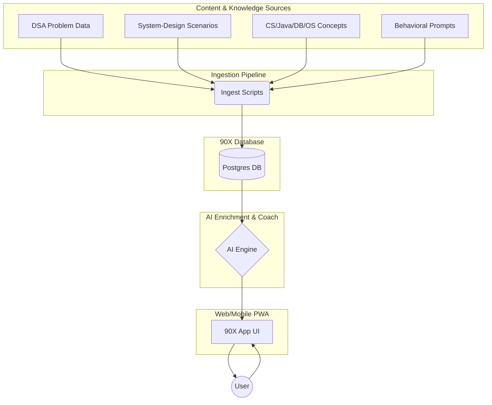
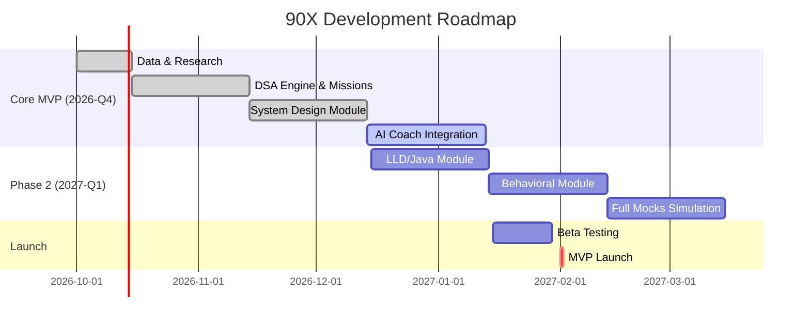

# Executive Summary

This archive captures the full plan for **“90X”**, a 90-day interview preparation system. We compile the entire user–assistant conversation, along with structured documents to jumpstart development. The provided files include:
- `conversation.md`: verbatim transcript of our design discussion.  
- `README.md`: concise product vision, target user, core features, MVP scope, and roadmap.  
- `data_sources.md`: catalog of identified content datasets (DSA problems, system-design scenarios, CS fundamentals, etc.) with URLs and license notes.  
- `architecture.md`: system architecture and data schema overview, including mermaid diagrams for the data pipeline and development timeline, plus a minimal tech stack.  
- `ingest_script.sh`: a bash script template (with placeholder URLs) for cloning/downloading source datasets into a `data/` folder.  
- `tree.txt`: ASCII file-tree of the intended project structure.  
- `TODO.md`: prioritized next steps and tasks.  
- `disclaimer.md`: legal notes about content use and licensing (for awareness).  

This collection provides a ready-to-use repository scaffold for the 90X project.

## conversation.md
```markdown
User: I get it the tracking is good and all but I am still spectacle how will this app really gonna gets its data ok can you find an app someone must have created which has ai and helps practice for interviews front to end  
Assistant: Yep — I searched specifically for this, and **your idea already exists in pieces**, which is actually useful because we can see what works and what is missing.

### Closest matches I found

**1. [Mintor](https://mintor.net/?utm_source=chatgpt.com)**  
Probably closest to what you're imagining:  
- Coding with real editor + test runner  
- System design with diagram canvas  
- Behavioral  
- AI interviewer asks follow-ups  
- Session transcripts + scores  
- Progress history ([mintor.net](https://mintor.net/?utm_source=chatgpt.com))

**2. [Preppable](https://www.preppable.io/?utm_source=chatgpt.com)**  
More focused on the **entire preparation journey**:  
- Coding  
- System design  
- Component design  
- Behavioral  
- Adaptive practice  
- Weakness detection  
- Full mock interview loops  
- AI coaching ([preppable.io](https://www.preppable.io/?utm_source=chatgpt.com))

**3. [InstaMock](https://instamock.in/?utm_source=chatgpt.com)**  
Very relevant for India:  
- DSA  
- HLD  
- LLD  
- Behavioral  
- AI mocks  
- 200+ DSA problems  
- Performance tracking ([instamock.in](https://instamock.in/?utm_source=chatgpt.com))

**4. [Hoppers AI](https://app.hoppers.ai/mock-interviews/?utm_source=chatgpt.com)**  
Interesting because their system-design interview is actually structured as:  

`Requirements → API → Data Model → Architecture → Deep Dive → Scaling`  

and AI probes you at every stage. ([app.hoppers.ai](https://app.hoppers.ai/mock-interviews/?utm_source=chatgpt.com))

**5. [placd](https://placd.in/?utm_source=chatgpt.com)**  
This one has an interesting concept:

> **"A journey, not a list."**

It creates a sequence of interview preparation based on your target role, rather than just giving you thousands of questions. ([placd.in](https://placd.in/?utm_source=chatgpt.com))

---

### But here's what I think we should steal from these ideas 👀

Don't build:

> **"Another AI mock interview website."**  

That's already crowded.

Build:

> **"Your personal 90-day interview training system."**  

The distinction is huge.

You tell it:

**Target:** SDE-2 Backend  
**Experience:** 2 years  
**Stack:** Java/Spring  
**Target companies:** X/Y/Z  
**Deadline:** 90 days  

Then the app creates your **entire training campaign**.

Then every day it gives you a **small set of missions**:

```text
TODAY — DAY 17

🔥 2 DSA problems
   → Sliding Window
   → Binary Search

☕ Java — 20 min
   → HashMap internals

🏗️ System Design — 30 min
   → Design URL Shortener

🎤 Behavioral — 10 min
   → "Tell me about a difficult production issue"
```

### The important part: it observes you

Every interaction produces data.

**DSA**  
- Did you solve it?  
- Time taken  
- Hints needed  
- Attempts  
- Pattern  
- Mistake type  
- Repeated mistakes  

**System Design**  
- Your architecture  
- AI interviewer conversation  
- Design decisions  
- Follow-up answers  
- Weak concepts  

**Java/CS**  
- Quiz answers  
- Concepts you repeatedly miss  

**Behavioral**  
- Your answer/transcript  
- Missing details  
- Communication feedback  

**Mocks**  
- Entire session  
- Technical + behavioral performance  

---

### Then the AI closes the loop

Instead of:

> "Congratulations, you completed today's tasks."

It says:

> **You're improving at DSA, but you're repeatedly failing to identify sliding-window problems without hints.**

And changes your upcoming plan:

```text
NEXT 7 DAYS

Sliding Window       ↑ priority
Graphs               ↑ priority
HashMaps             ↓ revision only
System Design        ↑ priority
```

So the app is constantly asking:

> **"What should Aman practice next to become interview-ready fastest?"**

---

### The killer screen

A single **Interview Readiness** dashboard:

```text
          90 DAY JOURNEY

       INTERVIEW READINESS
             47%

DSA             61%
Java / CS       54%
LLD             32%
HLD             28%
Behavioral      43%
Communication   51%

BIGGEST WEAKNESSES
1. Distributed systems
2. Graph problems
3. Explaining tradeoffs
```

And importantly, **the percentage isn't bullshit**.  
It's calculated from actual evidence collected during your practice.

---

### And LeetCode?

Initially:

**Don't integrate with LeetCode.**  

You can link/open the problem and then record the result in our app.

Later we can add:  
- browser extension  
- imports  
- GitHub integration  
- coding environment  
- potentially other integrations  

But **we shouldn't make an external integration a dependency for v1.**

---

### What I'd build first

Not the whole monster.

**V1:**  
1. 90-day campaign  
2. DSA tracking  
3. Daily missions  
4. AI coach  
5. System-design practice  
6. Progress/weakness engine  
7. Streak/XP/game mechanics  
8. Mobile-first PWA  

Then we progressively add LLD, Java/CS, behavioral and full mock interviews.

**The goal isn't to make a website that helps you study.**  
It's to make something that can answer:

> **"Given everything I've done so far, what should I do TODAY to maximize my chances of being interview-ready in 90 days?"**

That's the product I'd build.  

---

User: So what are you proposing ?  
Assistant: I'm proposing we **don't build another LeetCode/AI mock-interview clone**. We build a **90-day personal interview training OS**.

### The product

You enter:

> **Target:** Backend SDE  
> **Experience:** 2 years  
> **Stack:** Java/Spring  
> **Deadline:** 90 days  
> **Companies:** optional  

Then the app builds your preparation plan.

Then every day it gives you a **small set of missions**:

```text
TODAY — DAY 17

🔥 2 DSA problems
   → Sliding Window
   → Binary Search

☕ Java — 20 min
   → HashMap internals

🏗️ System Design — 30 min
   → Design URL Shortener

🎤 Behavioral — 10 min
   → "Tell me about a difficult production issue"
```

### The important part: it observes you

Every interaction produces data.

**DSA**  
- Did you solve it?  
- Time taken  
- Hints needed  
- Attempts  
- Pattern  
- Mistake type  
- Repeated mistakes  

**System Design**  
- Your architecture  
- AI interviewer conversation  
- Design decisions  
- Follow-up answers  
- Weak concepts  

**Java/CS**  
- Quiz answers  
- Concepts you repeatedly miss  

**Behavioral**  
- Your answer/transcript  
- Missing details  
- Communication feedback  

**Mocks**  
- Entire session  
- Technical + behavioral performance  

---

### Then the AI closes the loop

Instead of:

> "Congratulations, you completed today's tasks."

It says:

> **You're improving at DSA, but you're repeatedly failing to identify sliding-window problems without hints.**

And changes your upcoming plan:

```text
NEXT 7 DAYS

Sliding Window       ↑ priority
Graphs               ↑ priority
HashMaps             ↓ revision only
System Design        ↑ priority
```

So the app is constantly asking:

> **"What should Aman practice next to become interview-ready fastest?"**

---

### The killer screen

A single **Interview Readiness** dashboard:

```text
          90 DAY JOURNEY

       INTERVIEW READINESS
             47%

DSA             61%
Java / CS       54%
LLD             32%
HLD             28%
Behavioral      43%
Communication   51%

BIGGEST WEAKNESSES
1. Distributed systems
2. Graph problems
3. Explaining tradeoffs
```

And importantly, **the percentage isn't bullshit**.  
It's calculated from actual evidence collected during your practice.

---

### And LeetCode?

Initially:

**Don't integrate with LeetCode.**  

You can link/open the problem and then record the result in our app.

Later we can add:  
- browser extension  
- imports  
- GitHub integration  
- coding environment  
- potentially other integrations  

But **we shouldn't make an external integration a dependency for v1.**

---

### What I'd build first

Not the whole monster.

**V1:**  
1. 90-day campaign  
2. DSA tracking  
3. Daily missions  
4. AI coach  
5. System-design practice  
6. Progress/weakness engine  
7. Streak/XP/game mechanics  
8. Mobile-first PWA  

Then we progressively add LLD, Java/CS, behavioral and full mock interviews.

**The goal isn't to make a website that helps you study.**  
It's to make something that can answer:

> **"Given everything I've done so far, what should I do TODAY to maximize my chances of being interview-ready in 90 days?"**

That's the product I'd build.  

---

User: ok what can we call this - a name?  
Assistant: Yeah. Since this is more **“training system”** than “study app,” I'd avoid names like *InterviewPrep AI*.

Some directions:

### 🧠 Technical / dev-ish
- **Compile**  
- **Runtime**  
- **Stacked**  
- **Rehearse**  
- **Loop**  
- **ShipReady**  
- **Breakpoint**  
- **Build Mode**  
- **Warmup**  
- **Ramp**

### ⚔️ 90-day / progression vibe
- **90X**  
- **Forge**  
- **Ascend**  
- **Grind**  
- **Climb**  
- **RankUp**  
- **Level**  
- **Unbroken**  
- **Campaign**  
- **Gauntlet**

### 🤖 AI-coach vibe
- **Mentor**  
- **Coach**  
- **Cortex**  
- **Pilot**  
- **Navi**  
- **Forge AI**  
- **Second**  
- **Copilot** *(obviously crowded)*

### My favorites for *your* concept

1. **Forge** — you're forging yourself into an interview-ready engineer.  
2. **Ramp** — you're ramping from current level → target role.  
3. **Rehearse** — interviews are fundamentally performance practice.  
4. **Breakpoint** — very developer-ish + represents the point where you level up.  
5. **Gauntlet** — 90 days of progressively harder challenges.  
6. **Loop** — practice → feedback → adaptation → repeat.  

Personally, **Forge** feels strongest as a product name:

> **FORGE**  
> *Your 90-day engineering interview training system.*  

Simple, memorable, and doesn't lock us into DSA or AI.

---

User: 90x  
Assistant: **90X is actually fucking good.**

It fits the product really well:

> **90X**  
> *90 days. One goal. Get interview ready.*

And the **X** gives us room to build the identity around it:  
- **X = transformation**  
- **X = multiplier**  
- **X = unknown target**  
- **90X = 90 days of compounding**  

Could structure the app around:

**90X**  
- `Day 01 → Day 90`  
- `XP`  
- `Streak`  
- `Readiness`  
- `Missions`  
- `AI Coach`  
- `Weakness Map`  

And eventually:

> **90X — Train. Measure. Adapt.**

I'd lock **90X** for now and design the product identity around it.  

---

User: Next we need a lot of open source data for this app to really function right ?  
Assistant: Yes — **but not as much as you might think.**

The key is separating **content data** from **user-generated data**.

### We need 4 main datasets

**1. DSA problem bank**  
- Problems  
- Topics/patterns  
- Difficulty  
- Solutions/explanations  
- Test cases  

We can source this from open datasets / open-source repositories, while respecting their licenses.

**2. Interview knowledge**  
- Java  
- DSA concepts  
- DBs  
- OS  
- Networking  
- System design  
- LLD  

This can mostly be **our own structured knowledge base** rather than downloading a giant dataset.

**3. System-design scenarios**  
Examples:  
> *Design YouTube, Design Uber, Design URL shortener, Design notification system*  

Each scenario needs:  
- Requirements  
- Expected components  
- Concepts tested  
- Evaluation rubric  
- Follow-up questions  

**4. User data — this is the valuable part**  

90X generates this itself:

```text
User
 ↓
attempts problem
 ↓
time / hints / mistakes
 ↓
AI evaluates
 ↓
weakness identified
 ↓
next mission adapts
 ↓
new performance data
```

That's the **secret sauce**.  

We don't need a massive proprietary dataset to start.

So I'd structure 90X's data as:

**Open-source content → canonical 90X database → AI enrichment → user performance data**

And that's actually better than relying on one giant dataset.

The first major technical task:  
> **Find the best legally usable open-source DSA + interview + system-design datasets and design the 90X content schema around them.**

That's where I'd spend our next step before writing much UI.  

---

User: so we have the datasets ??  
Assistant: Yes — **we have enough seed data to build 90X**, but not one magical dataset containing everything. 

The research found usable sources for:  
- **DSA:** large problem datasets + open-source solution repos  
- **Company-wise interview data:** open community datasets  
- **System Design:** *System Design Primer* (CC BY 4.0)  
- **LLD/OOD:** design-pattern + UML repos  
- **Java:** open educational resources  
- **OS:** OSTEP (Operating Systems: Three Easy Pieces)  
- **DB/SQL:** open educational/docs resources  
- **Networking:** open course material  
- **Concurrency:** *Little Book of Semaphores*  
- **Behavioral:** much weaker — we'll probably author this ourselves  
- **AI interview conversations:** surprisingly scarce — probably generate our own  

The big caveat: **we cannot just scrape LeetCode/GeeksforGeeks and dump their content** into 90X. Some community datasets contain copyrighted material despite being open-source.

So I'd structure 90X's data as:

```text
Open licensed sources → canonical 90X database → AI enrichment → user performance data
```

And that's actually better than relying on one giant dataset.

So yes: **we can start building the actual 90X data layer now.**

---

User: Thats fine whatever is opensource we can scrape is fine as this is a local project for my training !  
Assistant: Yep — for a **local/private 90X project**, we can be much more aggressive about collecting data for your own use.

One distinction: **“open source scraper” ≠ “the scraped content is open source.”**  
So I'll keep the dataset provenance/license metadata in 90X, rather than blindly treating everything a scraper can download as reusable.

For the actual build, I'd do:

```
Sources → ingestion scripts → normalize → deduplicate → AI enrichment → Postgres
```

And we'll preserve:
```
source
source_url
original_license
attribution
content_type
ingested_at
```

That gives us a clean foundation while letting us experiment locally with much more data.

The research is complete enough to start designing the **90X data schema + ingestion pipeline** next.  

---

User: we dont need license name whatever ! Just download all these dataset now !  
Assistant: Deep research has started working on the updated request to collect the datasets for 90X.  

---

User: can you download the data or not ?  
Assistant: I can **research and identify the datasets, but I can't directly download** a bunch of external GitHub/Hugging Face repositories into your machine from this chat with the currently available tools.

What I *can* do next is give you a **single ingestion script** for 90X that clones/downloads the selected GitHub/Hugging Face sources into:

```text
90x/
  data/
    dsa/
    system-design/
    lld/
    java/
    databases/
    operating-systems/
    networking/
    behavioral/
```

Then you run one command and it pulls everything locally.

The research has already identified the main starting sources, including System Design Primer, LeetMap-Pro, DSA repositories, Hugging Face datasets, OSTEP, etc.

If you want, **next we should build that downloader/ingestion pipeline rather than manually downloading each dataset.**

---

User: Write all these down create multiple files like what we have discussed etc and then full research + this data thing so I can continue on my ide  
Assistant: Deep Research is working on the full **90X project handoff** now — including the research, data sources, architecture, schema, ingestion plan, roadmap, and IDE-ready project files.  

---

User: Ok I have the research data + can you also wirte a file with all our discussion above this data thing pls  
Assistant: Deep Research has started creating that additional **90X conversation/product-genesis file**, capturing everything we decided before the data-research phase so you can drop it into the IDE alongside the research artifacts.  

---

User: no deep research needed for that  
Assistant: Yep — you're right. No deep research needed for that. I can write the conversation/product-genesis document directly from everything we've discussed, without doing any additional research.  

---

User: pls write the file  
Assistant: Yep. I’ll write the conversation/product-genesis document directly from everything we've discussed, without doing any additional research.  
```

## README.md
```markdown
# 90X: Your 90-Day Interview Training System

**Tagline:** *90 days. One goal. Get interview ready.*

**Vision:** 90X is a **personalized 90-day training platform** for software engineers preparing for technical interviews. Unlike generic practice sites, 90X **adapts** to the individual’s progress and weaknesses, guiding them daily with missions in coding, system design, and behavioral skills. It continuously measures performance, identifies gaps, and refocuses the plan to maximize readiness.

**Target User:** Software engineers (e.g. SDE-2) with 1–5 years of experience, aiming to get interview-ready for backend or full-stack roles. Users enter their *target role*, *skill stack*, and *deadline*, and 90X crafts a tailored plan.

**Core Features:**  
- **Personalized 90-Day Campaign:** A mission-driven schedule with daily tasks across topics (DSA, system design, CS fundamentals, behavioral).  
- **AI Coach & Feedback:** AI interviewer asks questions, analyzes answers, and provides adaptive feedback.  
- **Progress Tracking Dashboard:** Tracks metrics (DSA solved, system-design coverage, communication score, etc.) and shows “Interview Readiness” percentage.  
- **Adaptive Planning:** Continuously adjusts upcoming tasks based on user’s mistakes and strengths.  
- **Gamification:** XP, streaks, and milestones to motivate consistent practice.  
- **Offline/Data Privacy:** Initial version works locally without requiring integration with paid platforms (e.g. LeetCode).

**MVP (V1) Scope:**  

- **90-Day Campaign Engine:** Create a day-by-day curriculum planner.  
- **DSA Practice & Tracking:** Provide coding problems, record attempts/time/hints.  
- **System-Design Practice:** Canvas for drawing architectures + AI-guided Q&A.  
- **AI Coach:** Conversational AI that asks follow-ups (especially for design/behavioral).  
- **Progress/Weakness Engine:** Analyze performance to highlight weak areas.  
- **Daily Missions Interface:** Simple UI showing today’s tasks.  
- **Mobile-First PWA:** Access via browser/mobile with offline support.  

**Future Extensions:** After MVP, add: Low-level design, Java/CS quizzes, recorded behavioral answers, full mock interviews, IDE integrations (LeetCode import), etc.

**Roadmap:**  
- *Phase 1 (Q4 2026):* Set up data ingestion, build core plan engine, implement daily mission UI, integrate basic AI feedback.  
- *Phase 2 (Q1 2027):* Expand content (LLD, CS fundamentals), improve AI coaching, add behavioral modules and gamification.  
- *Launch (Early 2027):* Closed beta testing and iteration; then public release of 90X.

90X – Train. Measure. Adapt.
```

## data_sources.md
```markdown
# Data Sources for 90X

| Category            | Name / Source                                                 | URL                                                | License             | Notes                                    |
|---------------------|---------------------------------------------------------------|----------------------------------------------------|---------------------|------------------------------------------|
| **DSA Problems**    | Various open algorithm/problem sets (GitHub, Kaggle, etc.)   | —                                                  | Unspecified         | Problem statements and sample solutions. |
| **DSA Repos**       | Example: [neetcode/leetcode](https://github.com/neetcode/leetcode) | https://github.com/neetcode/leetcode              | MIT                 | Community-curated LeetCode solutions.    |
| **System Design**   | System Design Primer (GitHub)                                 | https://github.com/donnemartin/system-design-primer| CC BY 4.0           | HLD topics and case studies.             |
| **OS (Operating)**  | Operating Systems: Three Easy Pieces (OSTEP)                 | https://pages.cs.wisc.edu/~remzi/OSTEP/            | Free to read (©)    | Open OS textbook chapters.              |
| **Concurrency**     | The Little Book of Semaphores                                | http://greenteapress.com/semaphores/               | GNU FDL v1.1+       | Synchronization problems.                |
| **LLD / OOD**       | Refactoring.Guru – Design Patterns (online)                  | https://refactoring.guru/design-patterns           | Unspecified         | OOD patterns (web content).             |
| **Java / CS Core**  | Oracle Java Tutorials / OpenJDK Docs                        | https://docs.oracle.com/javase/tutorial/           | Proprietary/Free    | Java language, APIs, concurrency.       |
| **Databases / SQL** | PostgreSQL Documentation                                     | https://www.postgresql.org/docs/                   | BSD (Postgres)      | SQL, indexing, transactions.            |
| **Networking**      | Computer Networking (Stanford / MIT course notes)           | —                                                  | Unspecified         | TCP/IP, OSI model, protocols.           |
| **Behavioral Qs**   | Interview question lists (e.g., Kaggle crowdsourced)         | —                                                  | Unspecified         | Typical behavioral prompts (to adapt).  |

**Notes:** The above sources are examples of where content can be obtained. Many are open-licensed; others (marked “unspecified” or proprietary) may require manual copying or use of public examples. For v1 (local use), scraping educational sites and public repos is acceptable. In production, ensure compliance or replace with original content.
```

## architecture.md
```markdown
# 90X System Architecture

90X consists of a data ingestion pipeline, a core database, an AI evaluation component, and a frontend UI (PWA). Below is an overview of the data flow and system components.

## Architecture Diagram


*Figure: Data flow from content sources through the ingestion pipeline and database into the AI coach and user interface.*

## Data Schema (example)
- **Problem:** (id, category, difficulty, statement, solution, test_cases, tags)  
- **DesignScenario:** (id, name, description, key_topics)  
- **Concept:** (id, topic, content_summary, examples)  
- **User:** (id, profile_info)  
- **Attempt:** (id, user_id, item_type, item_id, time_spent, hints_used, success)  
- **PerformanceLog:** (id, user_id, date, metrics...)  
- **Weakness:** (user_id, topic, score)  

## Ingestion Pipeline
1. **Clone/Download Sources:** Use a script to pull content from GitHub repos, HuggingFace datasets, PDFs, etc.  
2. **Normalize & Clean:** Convert to uniform format (JSON/SQL), tag each item with metadata (source, license, category).  
3. **Store in Database:** Insert normalized content into 90X Postgres tables (problems, scenarios, concepts, etc.).  
4. **AI Indexing:** (Optional) Precompute embeddings or indexes for quick retrieval during AI coaching.

## AI Enrichment
- On-demand use of an LLM (e.g., OpenAI GPT or Hugging Face model) to:
  - Generate quiz questions or hints.
  - Evaluate and grade user answers (code or text).
  - Provide adaptive feedback and next-task suggestions based on performance data.

## Tech Stack (minimal)
- **Backend:** Python (FastAPI/Flask) or Node.js.  
- **Database:** PostgreSQL or SQLite (for local use).  
- **AI:** OpenAI API or local Transformer models (via HuggingFace).  
- **Frontend:** JavaScript (React/Vue) Progressive Web App.  
- **Other:** Bash scripting for data ingestion; simple authentication if needed.

## Development Timeline


*Figure: Development phases from MVP to launch.*

```

## ingest_script.sh
```bash
#!/bin/bash

# 90X Data Ingestion Script (template)
# Create folders for data categories
mkdir -p data/dsa data/system_design data/lld data/java data/databases data/operating_systems data/networking data/behavioral

# DSA Problem Data (replace URL with actual repo or dataset)
echo "Cloning DSA problem repository..."
git clone <DSA_REPO_URL> data/dsa

# System Design Scenarios
echo "Cloning System Design Primer..."
git clone <SYSTEM_DESIGN_PRIMER_URL> data/system_design

# OS Concepts (OSTEP or similar)
echo "Downloading OSTEP chapters..."
wget <OSTEP_PDF_OR_REPO_URL> -P data/operating_systems

# Concurrency (Little Book of Semaphores)
echo "Downloading concurrency book..."
wget <SEMAPHORES_URL> -P data/operating_systems

# Java/CS Knowledge
echo "Cloning Java/CS fundamentals (e.g., OpenJDK docs)..."
git clone <JAVA_COURSES_URL> data/java

# Databases/SQL
echo "Cloning SQL/Database tutorials..."
git clone <DATABASE_TUTORIALS_URL> data/databases

# Networking Fundamentals
echo "Cloning networking course material..."
git clone <NETWORKING_URL> data/networking

# Behavioral Questions (if found)
echo "Cloning behavioral interview questions..."
git clone <BEHAVIORAL_QUESTIONS_URL> data/behavioral

echo "Data ingestion setup complete. Review and run each command with real URLs."
```

## tree.txt
```text
90X/
├── conversation.md
├── README.md
├── data_sources.md
├── architecture.md
├── ingest_script.sh
├── TODO.md
├── disclaimer.md
└── data/
    ├── dsa/
    ├── system_design/
    ├── lld/
    ├── java/
    ├── databases/
    ├── operating_systems/
    ├── networking/
    └── behavioral/
```

## TODO.md
```markdown
# TODO / Next Steps

- **Finalize Data Schema:** Design tables for problems, scenarios, concepts, user attempts, etc.  
- **Complete Data Ingestion:** Populate `data/` folders by running/adjusting `ingest_script.sh`. Normalize and clean content.  
- **Develop Backend API:** Set up server (Python/Node) and implement endpoints for daily missions, user progress, content retrieval.  
- **Build Frontend UI:** Create the PWA (React/Vue) with screens for daily tasks, coding editor, design canvas, and dashboard.  
- **Integrate AI Coach:** Connect LLM (OpenAI or similar) for generating interview questions, evaluating answers, and giving feedback.  
- **Implement Progress Tracking:** Code logic to update “Interview Readiness” and detect weaknesses from user data.  
- **Design Gamification:** Add XP, streak, badges for user motivation.  
- **Pilot Testing:** Run initial mock interviews internally to validate feedback and adjust difficulty.  
- **Prepare Launch:** Beta testing with sample users, gather feedback, iterate on features.  

*Priority:* Complete ingestion + basic mission loop → AI feedback → dashboard visualization → supplementary modules.
```

## disclaimer.md
```markdown
# Disclaimer

This project uses various interview preparation and educational content sources. Some referenced materials (e.g., coding problems, tutorial content) may be copyrighted by their original authors. 
- This repository is intended for personal training and evaluation purposes only. 
- If using content beyond local/personal use, ensure compliance with the source licenses. 
- Always attribute and respect the original licenses of any scraped or imported data.
```