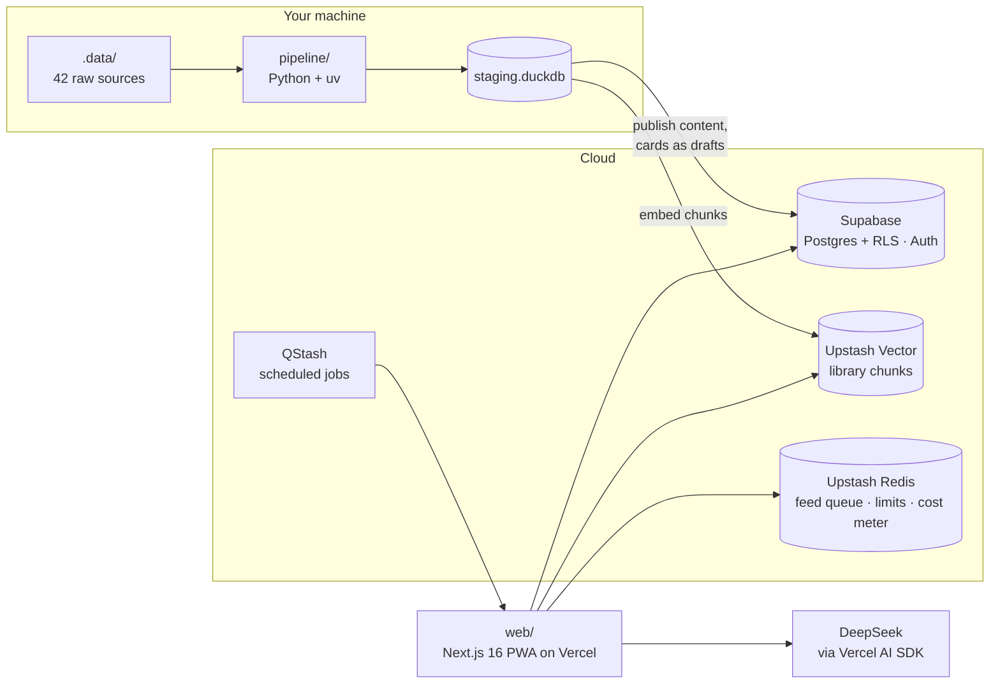

<div align="center">


# 90x

**Get interview-ready in 30, 60 or 90 days.**

Daily missions, a spaced-repetition card feed with AI grading, and a coach that knows what you've actually done.

[Live app](https://90x.amanarya.com) · [Spec](.planning/SPEC.md) · [Handoff notes](.planning/HANDOFF.md)

[](https://github.com/Am4nn/90x/actions/workflows/ci.yml)


</div>

---

90x is an invite-only interview-prep PWA for a small group of friends preparing for software engineering interviews. You pick a campaign length, it plans every day from your weakest areas, and readiness goes up only when you actually do the work.

Anyone can sign in with Google; an admin approves each account before it sees anything.

## What's in it

| Area | What it does |
|---|---|
| **Today** | A daily plan built from your weekday template: new problems, due reviews, a design topic, cards, mocks, stories. Each mission says why it was picked. |
| **90 Grid** | One square per campaign day: done, partial or missed. Streak with a revive. |
| **Readiness** | A 0–100 score per area (DSA, System Design, CS core, Java, SQL) computed from coverage and recent accuracy, never from vibes. |
| **Feed** | Scroll cards across the topics you switch on. Type an answer, the model grades it against key points, and FSRS schedules the next review. |
| **Library** | 3,693 problems, 5,290 notes and a Pattern Map of 191 pattern tricks, all readable in-app with source links. |
| **Check-ins** | Log a problem as solved, solved with hints or failed. Optional LeetCode sync fills these in from your public profile. |
| **Coach** | A tool-using chat with per-user memory. It searches the library, finds problems, reviews pasted solutions, teaches patterns, runs timed text mocks, builds your STAR story bank and writes a weekly review. Every action it proposes needs a tap to confirm. |
| **Me** | Progress, weekly reviews, stories, plan template, and a "What Coach knows" page you can edit. |
| **Admin** | Approve users, review generated card batches (90% good publishes a batch), handle flagged cards. |

Installable on phone and desktop, with Today and the Feed cached for offline use, and web push for streak reminders and the morning plan.

## How it fits together



- **Content** only changes through the pipeline's publish step and the `/admin` review. The app never writes content.
- **AI** runs on the server only. Flash grades answers; the smarter model runs the coach and mocks. Every call is logged to `ai_usage` and metered against a $10/month budget; past it, the coach falls back to the cheaper model and grading keeps working.
- **Coach search** is retrieval over Upstash Vector: the `search_knowledge` tool queries the index (built-in embeddings) and the coach cites the passages it used.

## Repository

```
.planning/   spec, plans, agent briefs, mockups (read SPEC.md first)
pipeline/    Python data pipeline: download → normalize → enrich → chunk → embed → cards → publish
supabase/    SQL migrations (source of truth, including RLS) and local config
web/         Next.js app (Bun)
.data/       raw downloads, git-ignored (~19 GB)
```

| Doc | Read it for |
|---|---|
| [`.planning/SPEC.md`](.planning/SPEC.md) | What 90x is and how every part works. Wins over everything else. |
| [`.planning/HANDOFF.md`](.planning/HANDOFF.md) | Current state, what to do next, and the traps this build hit. |
| [`.planning/briefs/README.md`](.planning/briefs/README.md) | House rules for code, design and PRs. Every brief points here. |
| [`.planning/plans/`](.planning/plans) | Implementation plans for each part, with their decisions. |
| [`.planning/mockups/`](.planning/mockups) | HTML mockups for the design system and screens. |
| [`web/AGENTS.md`](web/AGENTS.md) | Next.js 16 differs from older versions; read its bundled docs first. |

## Stack

| Layer | Choice |
|---|---|
| App | Next.js 16 (App Router), React 19 with React Compiler, TypeScript strict, Tailwind v4, shadcn/ui, TanStack Query |
| Data | Supabase Postgres with row-level security, Drizzle ORM on the server, Supabase Auth (Google) |
| Jobs and cache | Upstash QStash (schedules), Redis (feed queue, rate limits, cost meter), Vector (coach search) |
| AI | Vercel AI SDK; DeepSeek by default, switchable to Anthropic or any OpenAI-compatible endpoint by env |
| Spaced repetition | `ts-fsrs` |
| Pipeline | Python 3.12, uv, DuckDB, `openai` SDK against any OpenAI-compatible endpoint |
| Monitoring | Sentry, Vercel Analytics, Speed Insights |
| Tests | Vitest, Playwright, pytest, plus database checks against a throwaway Supabase |
| Hosting | Vercel (app), Supabase cloud, Upstash; the pipeline runs locally |

## Getting started

You need [Bun](https://bun.sh), [uv](https://docs.astral.sh/uv/) and Docker (for local Supabase).

### Web app

```bash
cd web
bun install
cp .env.example .env.local   # fill in values; each one is explained in the file
bun run db:start             # local Supabase, applies every migration
bun run dev                  # http://localhost:3000
```

After your first sign-in, make yourself an admin with `bun run admin:grant you@example.com`.

### Pipeline

```bash
cd pipeline
uv sync
cp .env.example .env
uv run pipeline sources                  # list the 42 sources
uv run pipeline download --skip-large    # or everything (~19 GB)
uv run pipeline normalize
uv run pipeline enrich
uv run pipeline chunk
uv run pipeline embed                    # upload changed chunks to Upstash Vector
uv run pipeline cards                    # generate and review cards (AI, costs money)
uv run pipeline publish                  # push staging to Supabase
uv run pipeline status                   # counts and LLM spend so far
```

Downloads are safe to re-run: git sources pull, Hugging Face downloads resume, files on disk are skipped. See [`pipeline/README.md`](pipeline/README.md).

## Web scripts

| Script | Does |
|---|---|
| `dev`, `build`, `lint`, `typecheck`, `test`, `test:e2e` | the usual |
| `format` / `format:check` | oxfmt (sorts imports and Tailwind classes) |
| `check:tokens` | design-token rules: six text sizes, token colours only |
| `check:dead` | knip: nothing exported and unused |
| `check:rls`, `check:tracker`, `check:feed`, `check:coach-tools` | real-database checks |
| `check:grading`, `check:coach` | call the real model; run locally only |
| `db:start` / `db:stop` | local Supabase |
| `db:new <name>` | new SQL migration |
| `db:reset` | rebuild the local DB from migrations |
| `db:push` | apply migrations to the linked cloud project |
| `db:pull` | pull the schema into Drizzle types (check the diff afterwards) |
| `db:types` | generate supabase-js types |
| `admin:grant`, `schedule:jobs` | make an admin, register QStash schedules |

## CI

Every push and PR runs five jobs in [`.github/workflows/ci.yml`](.github/workflows/ci.yml):

- **web**: typecheck, lint (ESLint + oxlint at zero warnings), format, Vitest, design tokens, dead code, build.
- **database**: every migration from empty against a throwaway Supabase, then the row-level security, tracker and feed checks.
- **e2e**: Playwright against local Supabase, a Redis stand-in and a fake OpenAI-compatible model, so no test calls a real one.
- **pipeline**: pytest.
- **deps**: `bun audit`, no deprecated direct dependencies, no outdated GitHub Actions.

## Contributing

Work is split into briefs in `.planning/briefs/`. Read [`.planning/briefs/README.md`](.planning/briefs/README.md) before touching code: it covers the security rule (every server query is scoped to the signed-in user, because Drizzle bypasses RLS), the design rules, the checks to run and the PR format.
